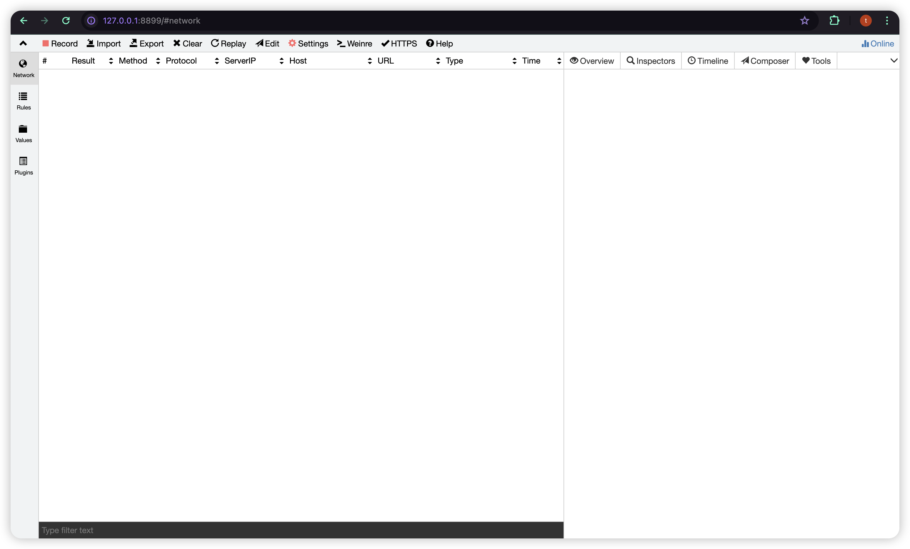
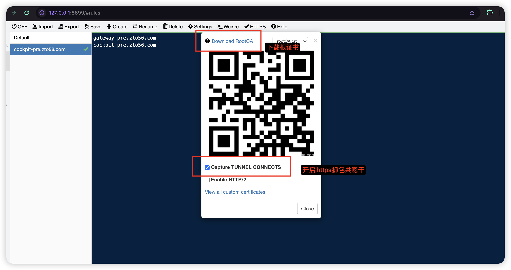
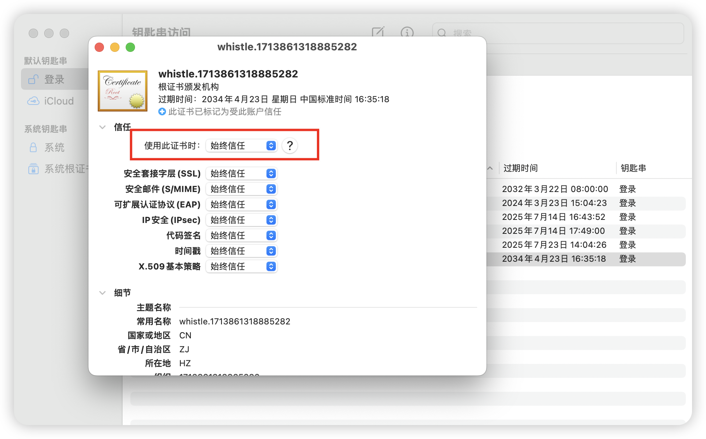
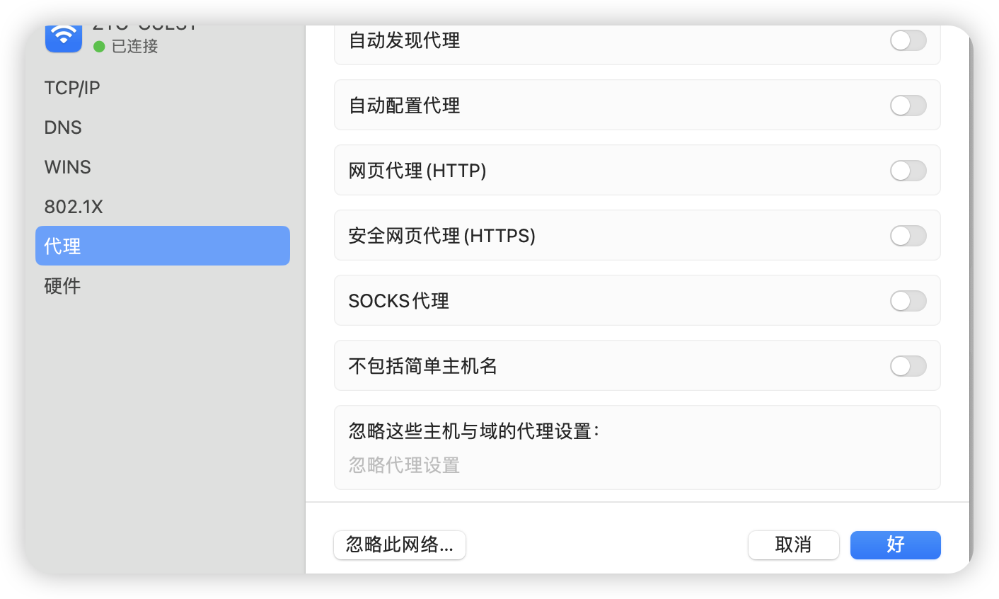
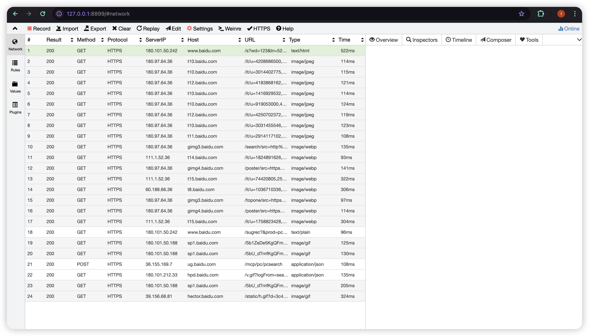
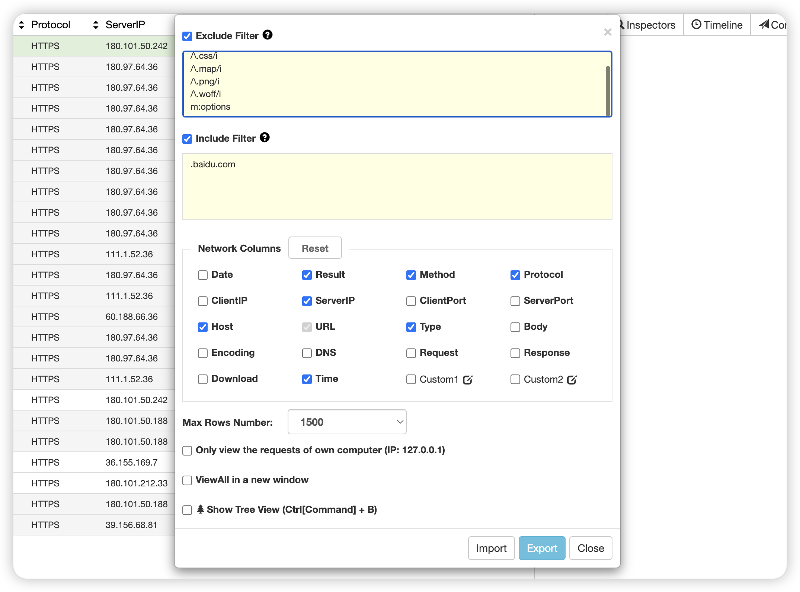

# whistle 抓包

#### 1 node环境

安装nodejs，通过homebrew安装node，本人安装的是v12.18.1，更新版本的也可以使用

安装完成后，通过命令` node --version`查看node 版本，如果出现对应版本号则安装成功

#### 2 安装whistle

通过命令行 npm install -g whistle，全局安装whistle，安装成功后通过 w2 help 查看,若出现`Usage: whistle <command> [options]`以及命令帮助提示，则表示安装成功。

#### 3 启动whistle

以下是几个常用命令：

 1  start    Start a background service  启动后台服务

 2  stop    Stop current background service  停止当前后台服务

 3  restart   Restart current background service  重新启动当前后台服务

正常情况使用 `whistle start`启动服务即可，如果更改了配置，需要使用`whistle restart`重启服务。

启动服务后，终端出现启动提示如下

````bash
[i] whistle@2.9.69 started
[i] 1. use your device to visit the following URL list, gets the IP of the URL you can access:
       http://127.0.0.1:8899/
       http://10.10.112.169:8899/
       http://10.202.252.3:8899/
       Note: If all the above URLs are unable to access, check the firewall settings
             For help see https://github.com/avwo/whistle
[i] 2. set the HTTP proxy on your device with the above IP & PORT(8899)
[i] 3. use Chrome to visit http://local.whistlejs.com/ to get started
````

此时我们可使用浏览器进入 http://127.0.0.1:8899/来访问whistle服务



下载根证书，下载完成后直接双击文件，进入钥匙串访问，双击刚才的whistle证书，展开`信任`栏，选择`始终信任`





#### 4 设置网络代理

设置中找到目前链接的网络，开启网页代理和安全网页代理



服务器和端口各自使用`127.0.0.1`和`8899`，这样浏览器网络就被whistle监控到了，此时浏览器访问服务，在whistle界面就可以看到网络记录了

下面是访问百度搜搜，使用关键词`123`的whistle监控情况



#### 5 设置过滤规则

在实际使用中，只需要关关注自己需要的网络资源访问情况，对于不关心的域名以及静态资源访问，可以排除，在`Network`-`Settings`面板，有`Exclude Filter`和`Include Filter`两个表单输入框，支持通过关键字（不区分大小写）或正则表达式匹配URL(`pattern`)、请求方法（`m:pattern`）、客户端IP（`i:pattern`)、请求头内容（`h:pattern`)，请求头的host字段（`H:pattern`)，多个条件用空格或换行符隔开。更改之后是立即生效的，可以`clear`清除当前面板后查看

```urlPatten
m:methodPattern
i:clientIpPattern
h:headersPattern
b:bodyPattern
H:reqHostPattern`
```



除此之外，还可以使用`Network`面板最下面的过滤框来简单过滤，比如输入`m:get`将过滤掉所有非get请求

#### 6 使用场景

在日常使用中，浏览器的开发者工具足够使用，但是某些特殊情况更适合使用抓包工具。

1. 非开发环境定位界面跳转时问题，比如统一登录平台，302响应
2. 移动端开发时需要定位接口问题，进行网络调试（需设置手机代理，手机与whistle在统一网络下）
3. mock数据，资源替换（配置Rules）